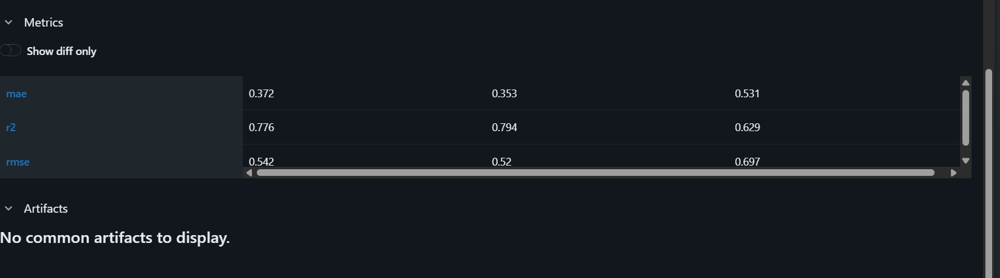

# ML Experiment Tracking with MLflow

## Description
This project uses MLflow to track and compare machine learning experiments for California Housing price prediction using GradientBoostingRegressor.

## How to Run
1. `pip install -r requirements.txt`
2. `python train.py`
3. `mlflow ui`

## MLflow Screenshot

## Comparison Table
| Run | Max Depth | Learning Rate | RMSE | MAE | R2 |
|-----|-----------|---------------|------|-----|----|
| Run 1 | 3 | 0.1 | 0.542 | 0.372 | 0.776 |
| Run 2 | 5 | 0.05 | 0.52 | 0.353 | 0.794 |
| Run 3 | 7 | 0.01 | 0.697 | 0.531 | 0.629 |

## Best Model
**Run 2** (Max Depth = 5, Learning Rate = 0.05)

## Why This Model?
Run 2 was selected because it has the lowest RMSE (0.52), which is the primary metric for this task. It also achieved the lowest MAE and the highest R2 score among all three runs.
